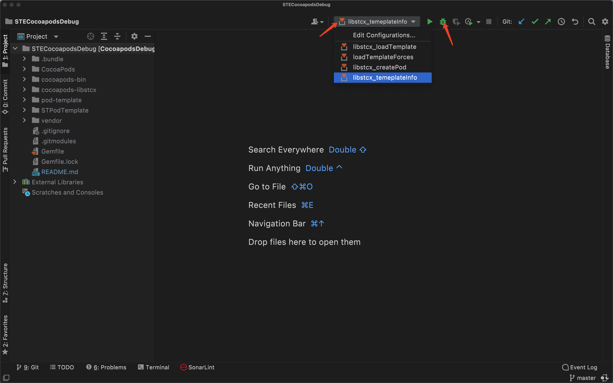

# STECocoapodsDebug

## Abstract

This project is a total repository of some sub projects.

- [CocoaPods](https://github.com/CocoaPods/CocoaPods.git)
- [cocoapods-bin](https://github.com/tripleCC/cocoapods-bin.git)
- [cocoapods-core](https://github.com/CocoaPods/Core.git)
- [pod-template](https://github.com/CocoaPods/pod-template.git)
- [cocoapods-yk-pod-utility](https://github.com/stephen5652/cocoapods-yk-pod-utility.git)

## Discussion

本仓库用于协助开发 cocoapdods 插件， 已关联了用于调试cocoapods的必须仓库，以及本人自己开发的cocoapods插件。

关联文档：

- [cocapods-plugin 介绍与开发](docs/PluginCreate.md) 
- [cocoapods 原理]()

## Usage

- install ruby
  - 本工程借助Ruby Mine 运行， 工程配置在 .idea 目录下
  - 需要使用ruby 2.7.5版本
  - 由于macOS ruby内置在系统中，所以使用了asdf管理多套ruby。
<br><br>

  读者可以借助 rvm, rubyenv，asdf 配置自己的ruby环境。
  
  环境配置相关：
  - [asdf](https://github.com/asdf-vm/asdf)
  - [【ruby mine】](https://www.jetbrains.com/ruby/) **由于 jetbrains 需要收费，需要读者自己想办法处理， 结果是可期的【能够使用！！！】。**

- prepare project

  - clone

    ```shell
    git clone https://github.com/STTechnology5652/STECocoapodsDebug.git --verbose
    ```
  - deal git submodule

    ```shell
    cd STECocoapodsDebug
    git submodule init
    git submodule sync
    ```
    
  - gem 下载
    ```shell
    cd STECocoapodsDebug
    bundle install --verbose
    ```

  - ruby mine
    不同于其他IDE， jetbrains 系列的IDE是通过 .idea 文件夹下配置一些列配置文件来管理项目；因为 用 rubymine 打开工程的步骤如下：
    - 打开 ruby mine
    - 菜单选项 'File' -> 'Open', 在弹窗选择工程文件夹【即 STECocoapodsDebug】
    
  - ruby mine 调试工程的时候，是通过一些列的指令实例来调试工程， 本项目已经配置了指令实例，使用方法：
    -  ruby mine 菜单选项 'Run' --> 'Run', 在弹窗选择指令实例。
    

## Tail

以上步骤是主体流程， 在具体下载实施的时候，可能会碰到各式各样的坑， 需要各种查资料。 最终目标是可期的，能够实现如下目标：

- 源码调试 cocoapods， 探寻cocoapods 原理
- 断点调试自己的 cocoapods 插件
