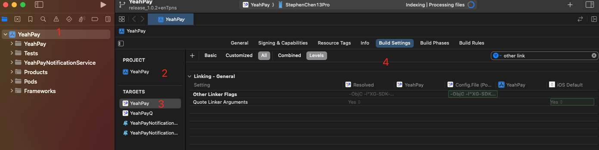
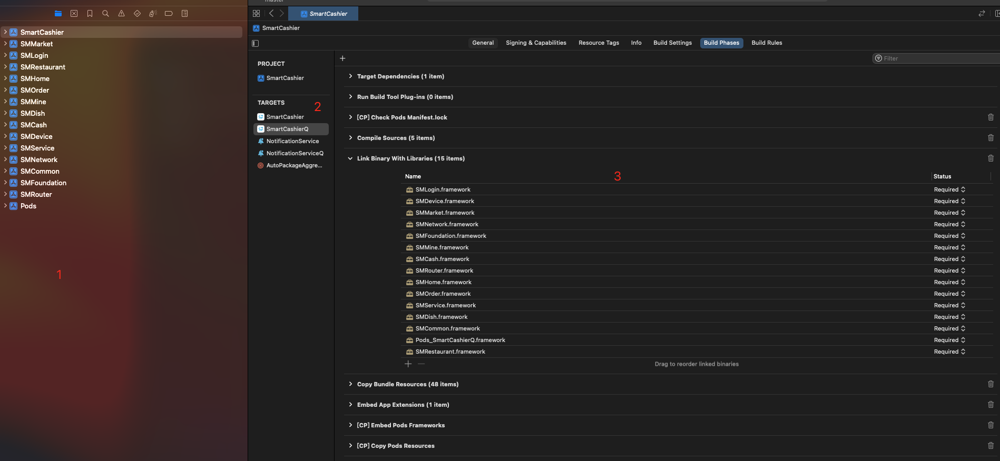
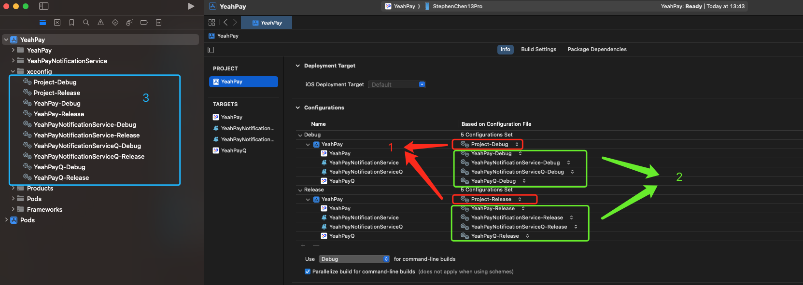
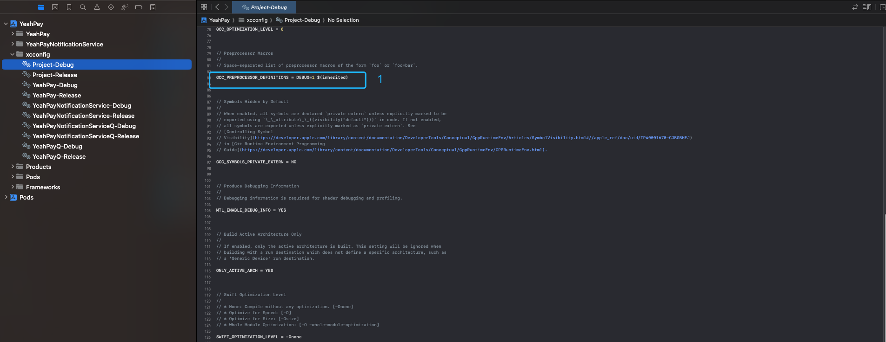
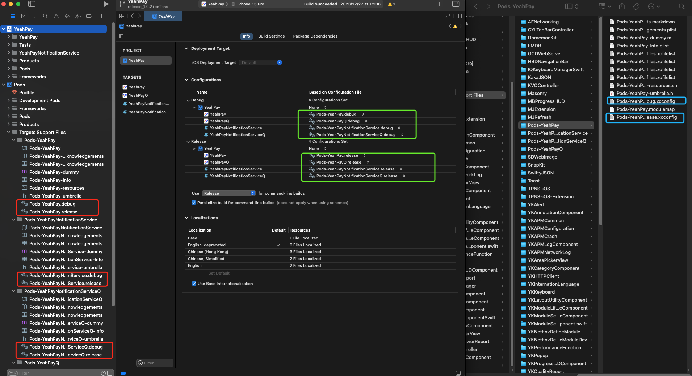
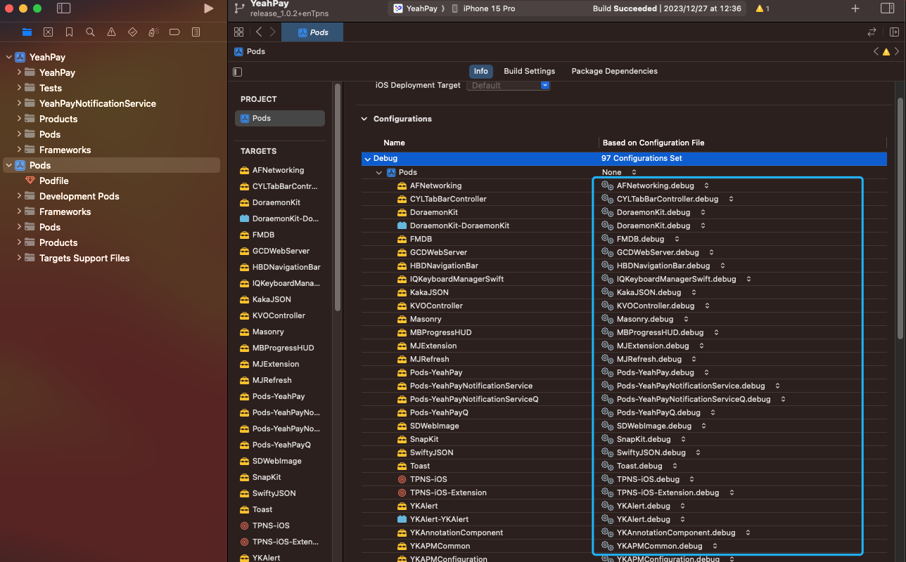
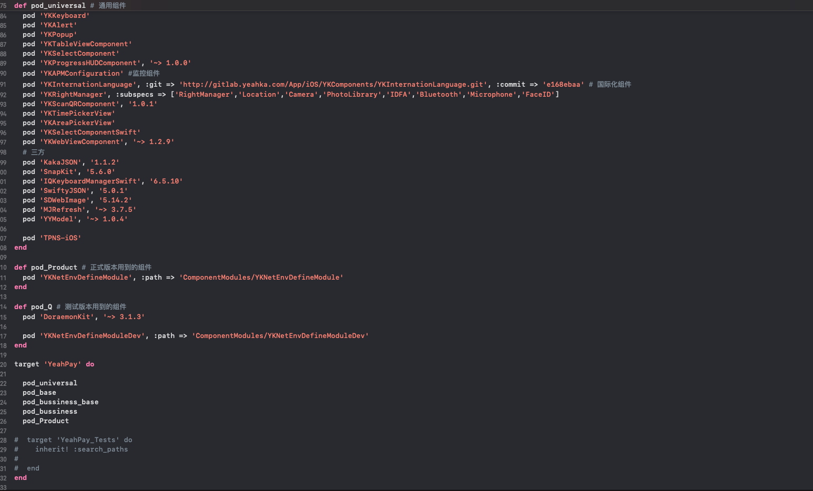
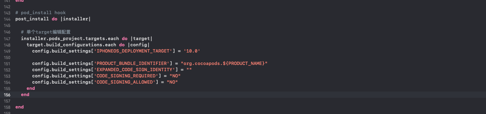

# cocoapods 使用与原理

## cocoapods介绍

cocoapods 是基于ruby语言开发的xcode工程的包管理工具。通过cocoapods可以便捷的引入三方库，提升ios的开发效率。
在xcode工程的开发中，类似的包管理工具还有：[carthage](https://github.com/Carthage/Carthage.git)， [swift-package-manager](https://github.com/apple/swift-package-manager.git)。

cocoapods由于更多的偏向于源码集成，而且更加成熟。所以xcode工程中，更多的使用cocoapods。另外两种使用的场景比较少，这里不做过多介绍。

## 传统 Xcode 工程的立项流程

- 通过 Xcode 创建工程
- 通过 cocoapods 引入三方
- 导入三方头文件，使用三方库的功能
- 功能开发

但是像react-native， SpringBoot, flutter, vue
项目，都是可以直接通过cli工具，自动生成模板工程，且基础配置齐全，可以很便捷的引入三方库，快速进入功能开发阶段。<br>
Xcode 工程其实也支持cli快速创建工程，这在之后的章节会提到。

## cocoapods使用

之所以说xcode工程，而不是提ios工程。是因为对于oc/swift语言，不单单是用于iOS【iphone OS】开发，还可用于watch OS， iPad OS， Mac
OS的开发。而它们都是用oc/swift开发。

cocoapods的接入流程如下：

- pod init

  Xcode 工程创建后，默认只是一个 .xcodeproj 的工程。所有的业务板块的开发都在这个工程中。<br/>
  但是通过pod init， 会cocoapods会在 .xcodeproj 统计目录创建一个podfile。

- 编辑 podfile

  如果需要使用某一个三方库，怎在podfile中声明对这个三方库的依赖。
  ```ruby
  pod 'YYModel', '~> 1.0.4'
  ```

  对于个别三方库，可能需要修改工程配置，传统的做法是在xcodeproj文件中手动修改；但高级的做法是，在podfile中修改。例如：

  ```ruby
  # pod_install hook

  post_install do |installer|

  # 单个target编辑配置

    installer.pods_project.targets.each do |target|
       target.build_configurations.each do |config|
           config.build_settings['IPHONEOS_DEPLOYMENT_TARGET'] = '10.0'
  
           config.build_settings['PRODUCT_BUNDLE_IDENTIFIER'] = "org.cocoapods.${PRODUCT_NAME}"
           config.build_settings['EXPANDED_CODE_SIGN_IDENTITY'] = ""
           config.build_settings['CODE_SIGNING_REQUIRED'] = "NO"
           config.build_settings['CODE_SIGNING_ALLOWED'] = "NO"
       end
     end
  end

  ```

- pod install

  修改podfile之后，在终端执行 pod install 指令，就可以引入三方库。

## xcode工程解读

在解说cocoapods原理之前，必须先讲解以下Xcode的工程结构。
一个标准Xcode工程，结构如下：



- 1 工程的文件列表
- 2 project
- 3 targets
- 4 工程配置

我们通过xcode创建的工程，其实就是project,  一个project可以编译出很多个不同用途的包[ios,  watchOS,  ipadOS,  macOS]<br>
在project之下包含了多个target，每个target就是定义了我们最终编译产物的配置、用途、以及其包含的文件。<br>

### xcode target

target 定义了编译配置，参与编译的代码文件，包适用的系统<br>
target通过集成project的配置，并覆盖project的配置，实现个性化编译的目的；从而实现工程的条件编译，达到灵活管理项目的目的。

### xcode workspace

workspace是高于project级别的一种管理项目的方式。可以在一个workspace中管理多个project，每个project声明对其他project的依赖关系，就可以实现多个project的联合开发。<br>
既然一个project可以又多个target，可以实现条件编译的目的。为什么又会有workspace呢。这是因为target的定位只是用于控制编译产物的用途，不适用与做项目功能拆分。<br>
对于复杂的app，如果只在一个project中做功能拆分，会发现工程会变得特别大，文件结构特别复杂，文件依赖关系几乎不能梳理。而通过project依赖，可以将一个功能板块集中在一个project中，只需要是在project层面管理业务板块之间的依赖。板块与板块之间通过部分文件的引用，实现功能的串联。

workspace管理的项目，结构如下：


- 1 workspace
- 2 target
- 3 依赖关系

### xcconfig 文件

上文说过，为了达到条件编译的目的，每个target都可以集成并重写project的配置。然而，xcode的文件是苹果自定义的xml格式的文件；文件超级臃肿，配置超级复杂；而工程师往往只需要改动一部分的配置，不需要大批量的改动配置。而且，在Xcode中寻找对应的配置，又过于麻烦。所以，苹果提供了另外一种修改项目配置的方式，即xcconfig文件。<br>
通过给每个target指定xcconfig文件，可以在xcconfig文件中，清晰明了的修改工程配置。也方便工程师排查项目配置。

在project中，配置xcconfig配置，如图：


- 1  工程级别的xcconfig配置
- 2 target级别的xcconfig配置
- 3 xcconfig文件

xcconfig文件内容如图：


- 1 例如常见的工程DEBUG 宏的配置
- 2 xcconfig 文件中可以写注释

## cocoapods原理

上个章节讲述了xcode工程的管理，而cocoapods正是在此管理原理的基础上实现配置化管理的。

### pods project

在执行 pog install指令的是，cocoapods会在原工程的xcodeproj同级目录创建一个xcworkpace， 一个Pods文件夹， 一个 Pods/pods.xcodeproj工程。<br>
同时会生成一系列 xcconfig文件，配置到原xcodeproj工程文件下。<br>
如图：


对应的，每个依赖进来的三方库，都会是pods.xcodeproj 工程下的一个target，且都有自己的xcconfig配置。<br>
如图：


### podfile解读

现在来说一个podfile。 这个是cocoapods的核心文件，用来声明target对三方库的引用关系。<br>
其内容主要涉及如下方面：

- 原工程target
- 三方库名称与版本
- 修改工程配置

第1、2点，iOS工程师一般都知道。但是第三点却是极少但又必须的用法。<br>
如图：





### podspec 文件解读

[【参考官方文档】](https://guides.cocoapods.org/syntax/podspec.html)