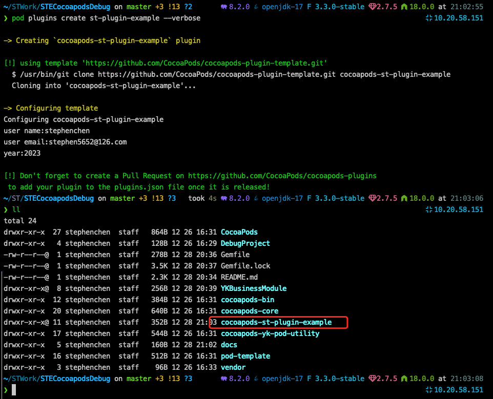
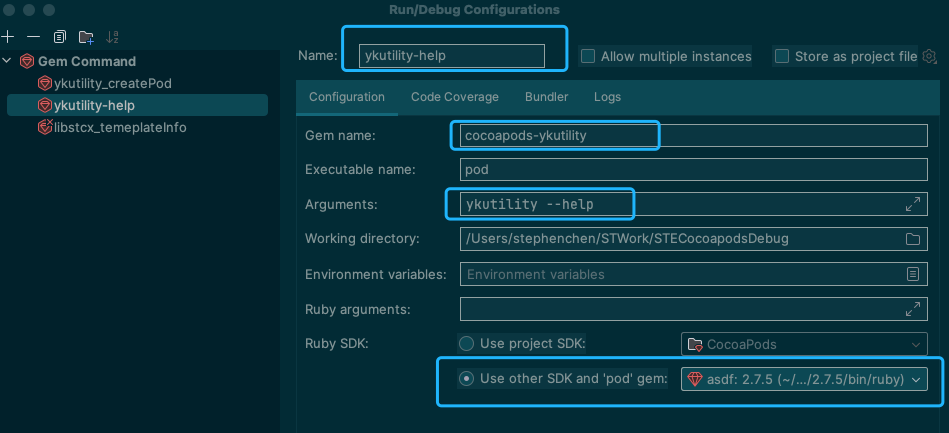
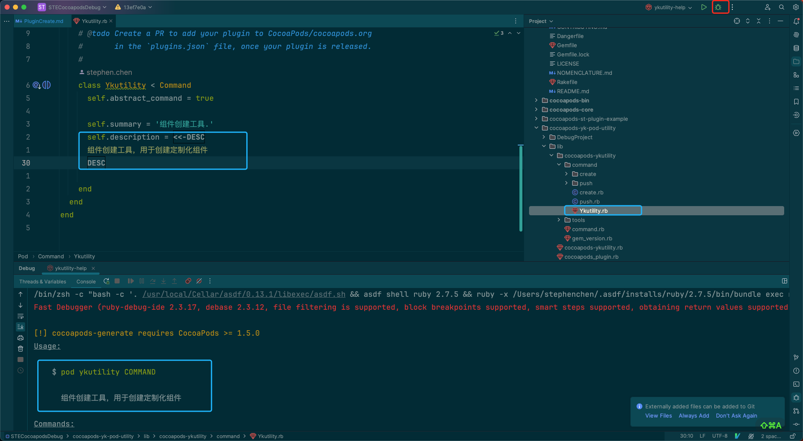
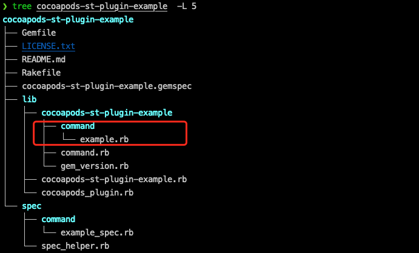
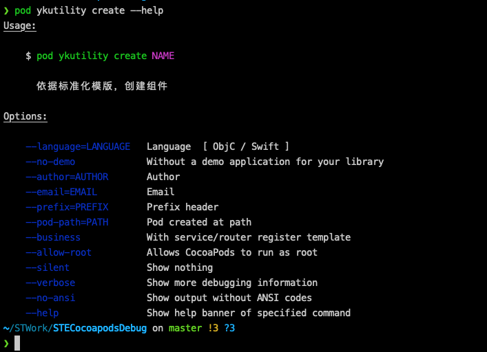
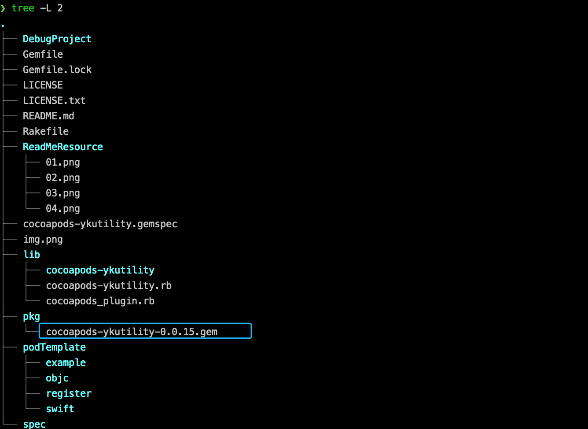
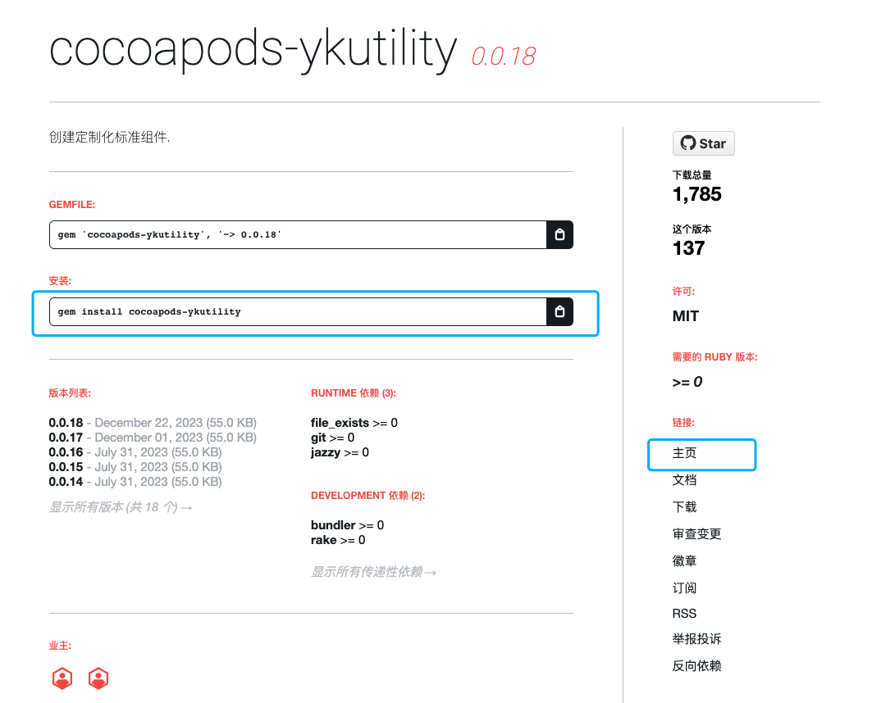

# cocapods-plugin 介绍与开发

## cocoapods-plugin 介绍

cocoapods 支持插件功能。 通过插件，可以大幅度丰富cocoapods的功能。 就个人来说，曾经用过的插件有：

- cocoapods-dependencies ： 列举Xcode工程通过cocoapods引进的pod，以及各个pod的依赖关系；
- cocoapods-deintegrate : 移除Xcode工程对cocoapods的依赖，净化Xcode工程。

类似的，还有很多cocoapods插件，自己可以去网上搜索。 也可以通过gem 来搜索cocoapods插件，例如：

```shell
gem search cocoapods --verbose
```

## 环境准备

- 开发ide

  cocoapods是基于ruby语言开发的，对于ruby语言的开发工具，最专业的是rubymine。所以需要在电脑安装rubymine开发ide。

- ruby版本管理

  由于Mac系统自带的ruby版本未必和cocoapods使用的ruby版本相同；所以需要借助ruby版本管理工具来指定对应的ruby版本来开发cocoapods插件。<br>
  常用的rubye本管理工具有[rvm](https://github.com/rvm/rvm.git)， [rubyenv](https://github.com/rbenv/rbenv.git)，[asdf](https://github.com/asdf-vm/asdf.git)
  。就我给人习惯，偏向于使用asdf。

## cocoapods-plugin 开发

插件的创建与开发，没有想象中的那么困难。 cococapods 提供了脚手架，可以快速创建插件模板，我们需要做的仅仅是把自己需要的功能开发出来，然后发布到gem，就可以了。

可以分为以下步骤：

> - 创建工程
> - 调试自己的plugin
> - 创建command
> - 定义参数
> - 编写自己的command
> - 发布自己的plugin

- 创建工程

  cocoapods提供了脚手架，可以通过模板创建插件工程：

  ```shell
  pod plugins create NAME
  ```

  模板会自动添加cocoapods前缀，创建后效果如下：

  

- 调试自己的plugin

  创建的plugin之后，需要和cocoapods原项目关联起来。具体步骤如下：

  > - 关联plugin： 在根目录的gemfile中依赖自己的项目；
  > - 执行install： bundle install
  > - 编写测试用例： 即在rubymine中新建gemcommand，编写一个自己plugin的测试用例； 常规操作是，编写一个help的用例，保证自己的plugin能够断点调试。

  效果如图：
  

  debug 效果如图：
  

- 创建command

  对于cocoapods来说，每个指令都是一个command。模板工程中，自动定义了一个command，如果自己的插件有多个指令，就需要自己创建command。这里有个技巧，就是将已有的command复制一份，重新命名，并修改类名，即可创建新的command。

  工程结构如下：
  

- 定义参数：

  平时使用pod指令的时候，都是附带参数的。这些参数是通过在cocoapods中定义声明，来实现的。

  以下为cocoapods-ykutility create command的定义：

  ```ruby
  # frozen_string_literal: true
  require 'cocoapods-ykutility/command/create/yk_create_pod_action'
  require 'cocoapods-ykutility/gem_version'
  
  module Pod
    class Command
      class Ykutility < Command
  
        require 'cocoapods-ykutility/command/create/yk_create_pod_config'
        class Create < Ykutility
          self.summary = 'Creates a new Pod'
          self.description = <<-DESC 依据标准化模版，创建组件   DESC
  
          self.arguments = [
            CLAide::Argument.new('NAME', true)
          ]
  
          def self.options
            [
              ['--language=LANGUAGE', 'Language  [ ObjC / Swift ]'],
              ['--no-demo', 'Without a demo application for your library'],
              ['--author=AUTHOR', 'Author'],
              ['--email=EMAIL', 'Email'],
              ['--prefix=PREFIX', 'Prefix header'],
              ['--pod-path=PATH', 'Pod created at path'],
              ['--business', 'With service/router register template'],
            ].concat(super)
          end
  
          def initialize(argv)
            @config = YKPod::YKCreatePodConfig.new()
  
            @config.name = argv.shift_argument
            @config.language = (["objc", "oc"].include? argv.option('language', "swift").downcase) ? "objc" : "swift"
            @config.with_demo = !argv.flag?('no-demo', false)
            @config.with_register = argv.flag?('business', false)
            @config.author = argv.option('author', open("|git config --global user.name").gets).strip.gsub('.', '')
            @config.author_email = argv.option('email', open("|git config --global user.email").gets).strip
            @config.prefix = argv.option('prefix', "YK")
            @config.path = File.expand_path(argv.option('pod-path', Dir.getwd.to_s))
            super
            @additional_args = argv.remainder!
          end
  
          def validate!
            super
            help! 'A name for the Pod is required.' unless @config.name
            help! 'The Pod name cannot contain spaces.' if @config.name =~ /\s/
            help! 'The Pod name cannot contain plusses.' if @config.name =~ /\+/
            help! "The Pod name cannot begin with a '.'" if @config.name[0, 1] == '.'
          end
  
          def run
            puts("create pod run")
            YKPod::YKCreate.new(@config).createAction()
          end
  
          def print_info
            UI.puts "\nTo learn more about the template see `#{CocoapodsYkPodUtility::YK_POD_TEMPLATE_PATH}`."
          end
        end
      end
    end
  end
  ```

  编译后产物，形式如下：
  

- 编写自己的command
  定义了参数后，就可以编写自己的功能代码。
  cocoapods是面向对象的高级语言。在创建组件之初，就已经想好了自己要实现的功能。此时只需要通过ruby语言，将自己的需求在run方法中实现出来。

  ```ruby
  def run
    puts("create pod run")
  end
  ````

- 发布自己的plugin

  plugin开发完成之后，是为了发布出去，便于使用的。一般来说，都会发布到gem源中。
  plugin的发布，需要使用[rake](https://github.com/ruby/rake.git)。步骤如下：

    - rake build

      可以通过rake buile，编译自己的plugin，然后使用gem install 安装到本机电脑来测试功能是否和自己本机的环境相匹配。这一步不是必需，但是执行了，可以更容易发现兼容性问题。
      指令：

      > ```shell
      > rake build
      > ```
      >
      > ```shell
      > gem install pkg/XXXX.gem
      > ```

      rake build 的效果如图：
      会在pkg目录下创建对应的gem文件。

      

    - rake release

      plugin开发完并验证没问题之后，就可以发不到[gem org](https://rubygems.org/)。发布指令为 rake release

      rake 会自动根据gemspec中定义的version，创建对应的tag，并自动编译项目，将编译后的gem包推送到gem source；
      同时在git仓库创建对应的tag，并推送到远端git仓库。

    - 安装发布后的plugin

      plugin发布后，自己的邮箱是会收到[gem org](https://rubygems.org/)的邮件的。这时候，在gem org就可以搜索到plugin，以及其所有版本。如图：

      
